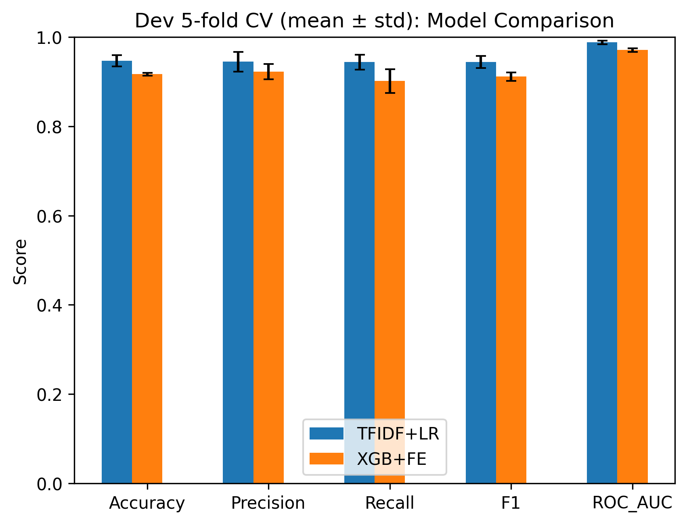
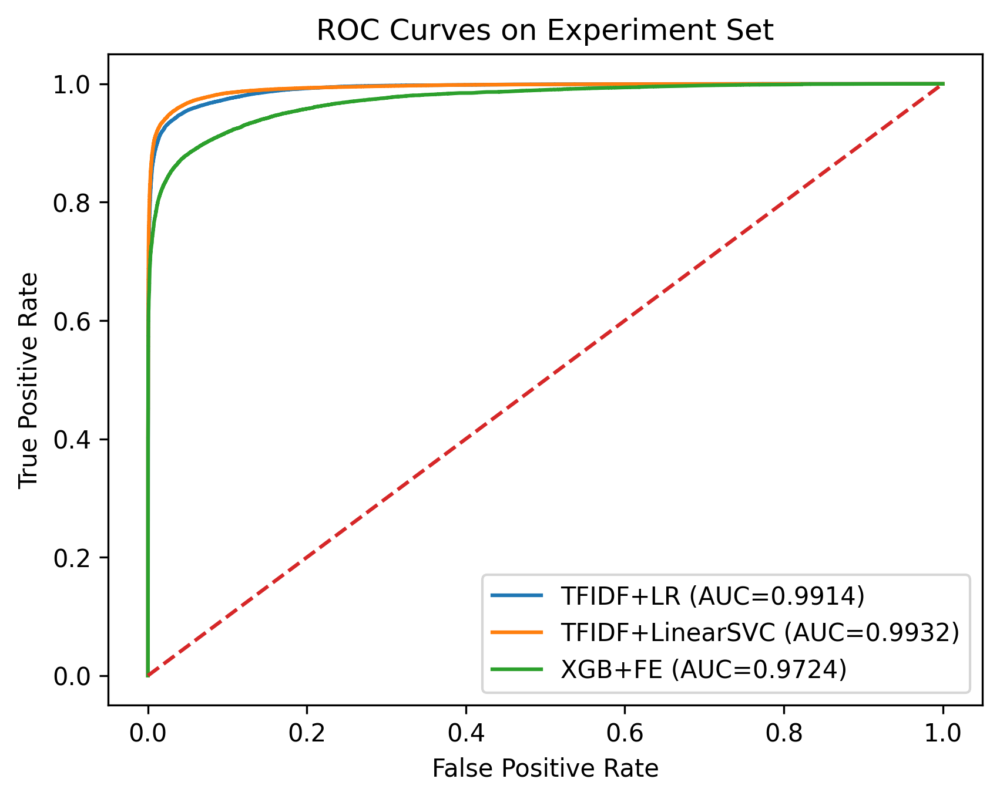
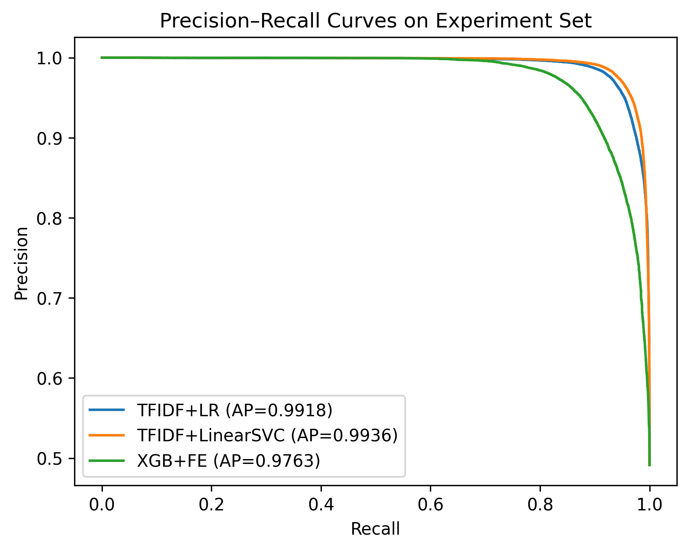
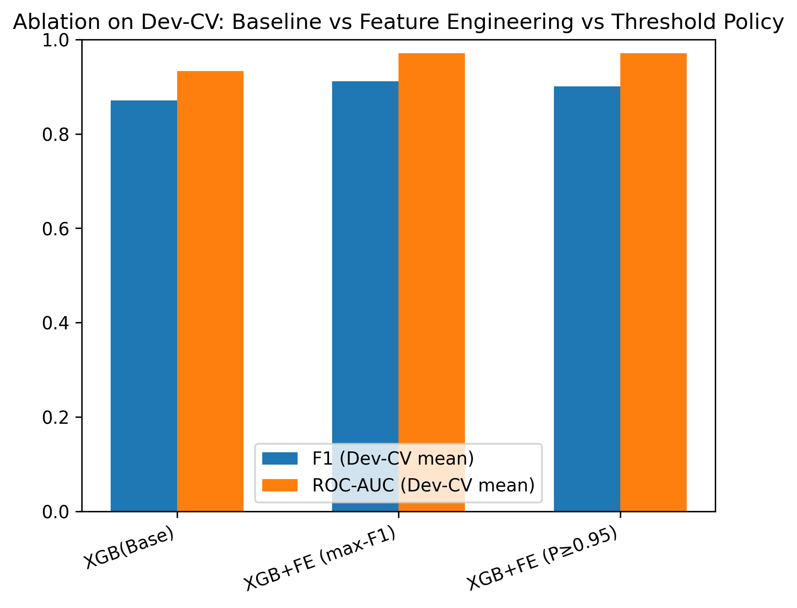

# PhishingLess: Browser-Based Anti-Phishing Protection System

PhishingLess is a Chrome-compatible anti-phishing browser extension that combines real-time URL risk detection, a machine learning backend, and user-centered warning interactions.

This project was developed as a research prototype to explore how URL-based phishing detection can be integrated into real browsing workflows while balancing security effectiveness, system reliability, and user experience.

## Design Motivation

Traditional phishing protection mechanisms (e.g., browser blacklists) often face trade-offs between detection coverage, latency, and usability. Frequent warnings can also lead to "warning fatigue", where users begin to ignore security alerts altogether.

PhishingLess is designed not only to detect phishing URLs, but to provide **usable security** in real-world browsing. The system balances detection accuracy with user experience by:

- reducing unnecessary interruptions through caching and deduplication

- allowing user-controlled trust decisions (whitelist, session-based proceed)

- introducing multi-stage warnings instead of immediate blocking

- providing clear and contextual feedback during detection

This design aims to improve long-term user compliance with security warnings.

## Why URL-based Lightweight Detection

Unlike models that rely on full webpage content, PhishingLess uses a lightweight URL-based detection approach.

This design enables:

- real-time detection before page rendering

- low latency suitable for browser environments

- reduced resource consumption

- early-stage intervention during navigation

The XGBoost model is selected for its balance between performance, interpretability, and deployment efficiency.

## Key Features

- Real-time phishing URL detection through a local backend API

- Chrome-compatible browser extension

- Multi-stage detection workflow:

  - link hover / click preview

  - navigation-time checking overlay

  - high-risk warning page

- User trust controls:

  - proceed for the current session

  - persistent whitelist

  - trust-host mechanism

- Caching and request de-duplication to reduce repeated checks

- Machine learning-based URL risk scoring using XGBoost

- Evaluation design covering both offline model performance and browser-side usability concerns

## System Design Highlights

- Event-driven browser architecture for real-time interaction handling  

- Multi-stage interception pipeline (hover, navigation, warning page)  

- Backend–frontend decoupling via REST API  

- Caching and in-flight request guard to prevent duplicate detection  

- Fault-tolerant communication between browser and backend  

- User-centered trust control system (whitelist, session bypass)  

## Results (Model & System Evaluation)





The threshold selection demonstrates a trade-off between reducing false positives (important for user trust) and maintaining detection recall, which is critical for real-world browser deployment.



## System Architecture

```text

PhishingLess/

├── extension/

│   ├── images/

│   ├── background.js

│   ├── content.js

│   ├── manifest.json

│   ├── popup.html

│   ├── popup.js

│   ├── warning.html

│   └── warning.js

├── app.py

├── phish_model_xgbfe.py

├── saved_models/

└── README.md
